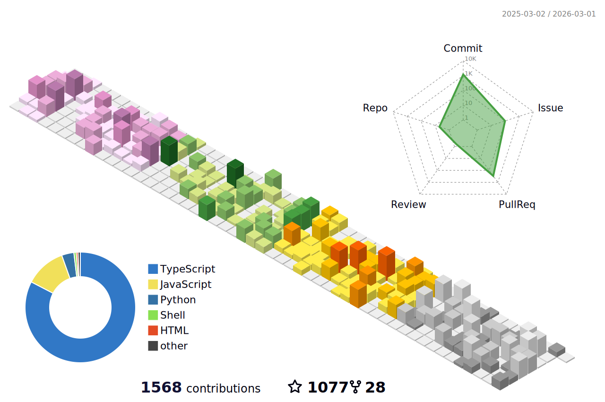

### Hi there, I'm Samayun Chowdhury 👋

<!--  -->

###  I'm a 😍 Software Engineer 😍
- 🌱 I’m currently exploring <b class="H1"> Machine Learning  </b> 
- 🥅 2024 Goals: <b style="color: green"> Scikit-learn</b>,<b>PyTorch</b>
- ⚡ Fun fact: I love to explore latest technolgies & reading books

<!-- <table style="border:5px red;color:red;display:none;">
 <tr border="0">
  <td border="0">

  </td>
    <td border="0"> </td>
 </tr>
</table> -->

###  Connect with me: 

 

<!--
 -->

###  Languages and Tools:

  
  
  
  
  
  
  
  
  
  
  
  
  
  
  
  
  

<!-- &nbsp; 

<!--  -->

### 📝 Latest Blog Articles

<!-- BLOG-POST-LIST:START -->
- [রেডিস কথন ৪](https://samayun.medium.com/%E0%A6%B0%E0%A7%87%E0%A6%A1%E0%A6%BF%E0%A6%B8-%E0%A6%95%E0%A6%A5%E0%A6%A8-%E0%A7%AA-594c4c4d2725?source=rss-39ef8cdf061a------2)
- [রেডিস কথন ৩](https://samayun.medium.com/%E0%A6%B0%E0%A7%87%E0%A6%A1%E0%A6%BF%E0%A6%B8-%E0%A6%95%E0%A6%A5%E0%A6%A8-%E0%A7%A9-b733cb4bd3f0?source=rss-39ef8cdf061a------2)
- [রেডিস কথন ২](https://samayun.medium.com/%E0%A6%B0%E0%A7%87%E0%A6%A1%E0%A6%BF%E0%A6%B8-%E0%A6%95%E0%A6%A5%E0%A6%A8-%E0%A7%A8-66d0f6cb862b?source=rss-39ef8cdf061a------2)
- [রেডিস কথন ১](https://samayun.medium.com/%E0%A6%B0%E0%A7%87%E0%A6%A1%E0%A6%BF%E0%A6%B8-%E0%A6%95%E0%A6%A5%E0%A6%A8-%E0%A7%A7-3da03a6e94db?source=rss-39ef8cdf061a------2)
- [Setup CI/CD for typescript based npm package](https://samayun.medium.com/setup-ci-cd-for-typescript-based-npm-package-3f3c6354b143?source=rss-39ef8cdf061a------2)
- [Play with TypeScript in one blog](https://dev.to/samayun/play-with-typescript-in-one-blog-204g)
- [Let’s burn your code by fire](https://samayun.medium.com/lets-burn-your-code-by-fire-dffb383e0634?source=rss-39ef8cdf061a------2)
- [Most productive exception handling ever on Node.js](https://samayun.medium.com/most-productive-exception-handling-ever-on-node-js-96828aac83cf?source=rss-39ef8cdf061a------2)
- [Answer by Samayun Miah Chowdhury for No CORS error when making GET requests, but CORS error when making POST requests](https://stackoverflow.com/questions/70165722/no-cors-error-when-making-get-requests-but-cors-error-when-making-post-requests/70166231#70166231)
- [Array to Hashmap in Node.js application](https://samayun.medium.com/array-to-hashmap-in-node-js-application-36862cb8746c?source=rss-39ef8cdf061a------2)
<!-- BLOG-POST-LIST:END -->

❤️ [...more blog articles](https://samayun.medium.com)  

### 📊 GitHub Stats:

<!--
<table style="border:5px red;color:red;display:none;">
 <tr border="0">
  <td border="0" width="50%">
  
  </td>
  <td border="0">  </td>
 </tr>
</table>
-->

<!--  -->

[banner]: https://media-exp1.licdn.com/dms/image/C5616AQHQz0FrV4bLEQ/profile-displaybackgroundimage-shrink_350_1400/0/1623739764608?e=1635984000&v=beta&t=l0lyl6NmBRwIvF1pm_4C9lmYMq-7J1obJ812lY3XAtk
[office]: https://www.linkedin.com/company/sayburgh-solution
[website]: https://github.com/samayun
[twitter]: https://twitter.com/samayunmc
[linkedin]: https://linkedin.com/in/samayun
[webdevplaylist]: https://github.com/samayun?tab=repositories
[jsplaylist]: https://github.com/samayun?tab=repositories&q=js
[cssplaylist]: https://github.com/samayun?tab=repositories&q=css
[dockerplaylist]: https://github.com/samayun?tab=repositories&q=docker
[reactplaylist]: https://github.com/samayun?tab=repositories&q=react
[reduxplaylist]: https://github.com/samayun?tab=repositories&q=redux
[vueplaylist]: https://github.com/samayun?tab=repositories&q=vue
[firebaseplaylist]: https://github.com/samayun?tab=repositories&q=firebase
[nestplaylist]: https://github.com/samayun?tab=repositories&q=nest
[laravelplaylist]: https://github.com/samayun?tab=repositories&q=laravel
[graphqlplaylist]: https://github.com/samayun?tab=repositories&q=graphql
[mysql]: https://github.com/samayun?tab=repositories&q=mysql
[typescript]: https://github.com/samayun?tab=repositories&q=typescript
[kubernetes]: https://github.com/samayun?tab=repositories&q=kubernetes
