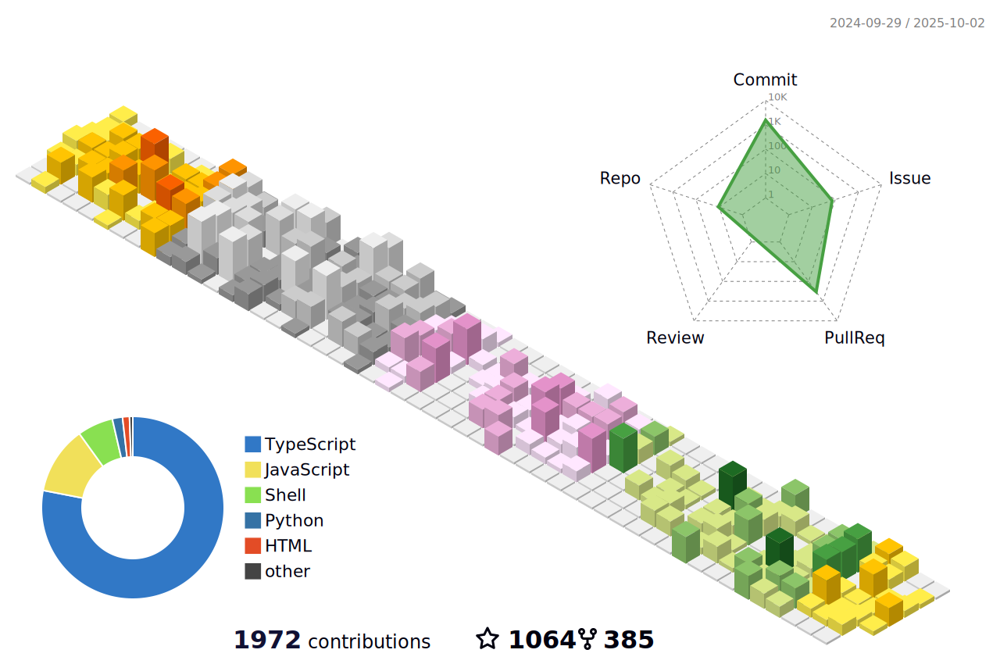

### Hi there, I'm [Samayun Chowdhury][website] 👋

###  I'm a 😍 JavaScript Lover 😍

- 🔭 I’m currently working at [Sayburgh Solutions][office] as a backend developer
- 🌱 I’m currently learning <b class="H1">Kubernetes   </b>
- 🥅 2022 Goals: <b style="color: green"> TypeScript</b>, <b> Nest.js</b>, <b>GraphQL</b>, <b>Microservice Architecture </b>
- ⚡ Fun fact: I love to explore latest technolgies & reading books

<!-- <table style="border:5px red;color:red;display:none;">
 <tr border="0">
  <td border="0"> </td>
    <td border="0"> </td>
 </tr>
</table> -->

###  Connect with me: 

 

<!--
 -->

###  Languages and Tools:

[][dockerplaylist]

<!-- [][kubernetes] -->

[][graphqlplaylist]

[][typescript]

[][reactplaylist]

[][vueplaylist]

[][webdevplaylist]

[][laravelplaylist]

<!-- &nbsp; -->

<!--  -->

<!--  -->

[banner]: https://media-exp1.licdn.com/dms/image/C5616AQHQz0FrV4bLEQ/profile-displaybackgroundimage-shrink_350_1400/0/1623739764608?e=1635984000&v=beta&t=l0lyl6NmBRwIvF1pm_4C9lmYMq-7J1obJ812lY3XAtk
[office]: https://www.linkedin.com/company/sayburgh-solution
[website]: https://samayun-mc.web.app
[twitter]: https://twitter.com/samayunmc
[linkedin]: https://linkedin.com/in/samayun
[webdevplaylist]: https://github.com/samayun?tab=repositories
[jsplaylist]: https://github.com/samayun?tab=repositories&q=js
[cssplaylist]: https://github.com/samayun?tab=repositories&q=css
[dockerplaylist]: https://github.com/samayun?tab=repositories&q=docker
[reactplaylist]: https://github.com/samayun?tab=repositories&q=react
[reduxplaylist]: https://github.com/samayun?tab=repositories&q=redux
[vueplaylist]: https://github.com/samayun?tab=repositories&q=vue
[firebaseplaylist]: https://github.com/samayun?tab=repositories&q=firebase
[nestplaylist]: https://github.com/samayun?tab=repositories&q=nest
[laravelplaylist]: https://github.com/samayun?tab=repositories&q=laravel
[graphqlplaylist]: https://github.com/samayun?tab=repositories&q=graphql
[mysql]: https://github.com/samayun?tab=repositories&q=mysql
[typescript]: https://github.com/samayun?tab=repositories&q=typescript
[kubernetes]: https://github.com/samayun?tab=repositories&q=kubernetes
